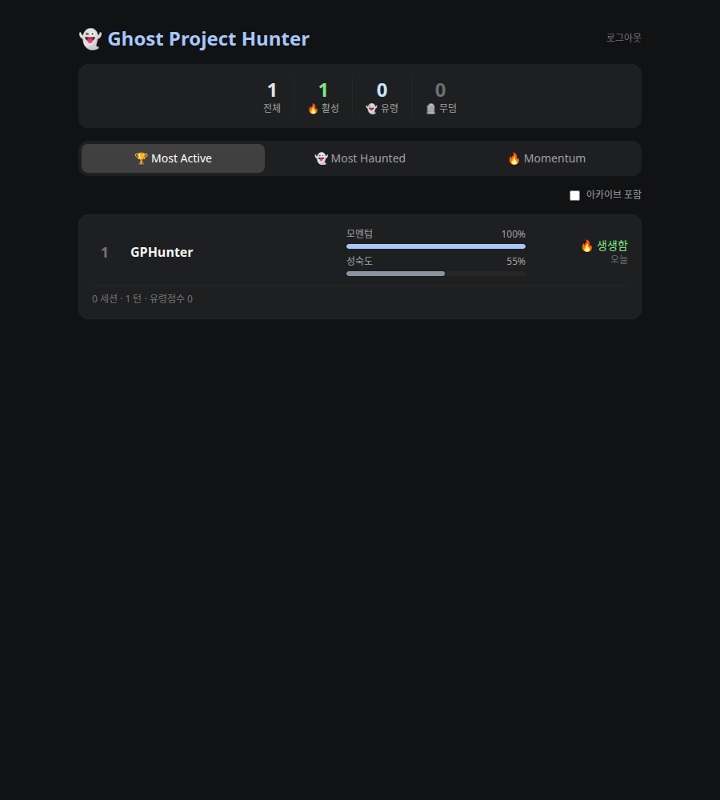

# 👻 Ghost Project Hunter

> **🌐 언어:** 한국어 · [English](README.en.md)

> AI CLI 툴(Claude Code)로 만든 수많은 프로젝트 중 **잊혀가는 '유령 프로젝트'를
> 게임 리더보드로 추적·관리**하는 멀티 디바이스 대시보드.

AI 덕분에 프로젝트 만들기는 쉬워졌지만, 그만큼 방치되고 잊히는 프로젝트도
늘어납니다. Ghost Project Hunter는 Claude Code 세션 활동을 **Hook으로 자동
수집**해서, 지금 살아있는 프로젝트와 위험하게 방치된 유령 프로젝트를 한 화면에
랭킹으로 보여줍니다.



---

## ✨ 주요 기능

- **자동 수집** — Claude Code의 `SessionStart`/`SessionEnd` Hook으로 작업 활동을
  수동 입력 없이 수집. (Node CLI 또는 순수 셸, 둘 다 제공)
- **유령 리더보드** — 3가지 정렬: 🏆 가장 활발 / 👻 가장 위험한 유령 / 🔥 모멘텀.
- **기여도 히트맵** — 각 카드에 GitHub 잔디밭 형태의 최근 30일 기여도 맵. 그날
  작업량(턴)이 많을수록 칸이 진해집니다.
- **투자 가중 유령 점수** — 오래 공들였는데 버려진 프로젝트가 더 위험한 유령으로
  상위 랭크. (`방치일수 × log10(턴수+10)`)
- **다기기 동기화** — 노트북·데스크탑이 같은 git 저장소를 작업하면 **한 프로젝트로
  자동 병합**. 나중에 git remote를 추가해도 기록이 끊기지 않음(별칭 병합).
- **장애 격리** — Hook은 타임아웃·항상 `exit 0`·오프라인 큐잉으로 **Claude 동작을
  절대 막지 않음**.
- **가벼운 설치** — DB는 SQLite 파일 하나. 별도 인프라 불필요.

---

## 🏗 작동 방식

```
[Claude Code]
   │ Hook(SessionStart/End) → stdin JSON (cwd, transcript_path, …)
   ▼
[ghost-hunter 에이전트]  (Node CLI 또는 셸)
   │ git remote 정규화로 프로젝트 키 생성 · 턴수/변경파일/성숙도 수집
   │ POST /api/v1/events (Bearer 토큰), 실패 시 outbox 큐잉
   ▼
[API 서버: Node + Express + SQLite]   ← 여러 기기가 같은 서버로 전송
   │ 프로젝트 upsert(별칭 병합) · 유령점수/모멘텀 계산
   ▼
[대시보드: React + Vite + Tailwind]   ← 리더보드
```

워크스페이스 구성:

| 워크스페이스 | 설명 |
|---|---|
| `shared` (`@gph/shared`) | 이벤트 zod 스키마 + 유령점수/모멘텀/성숙도 순수 로직 (단일 소스) |
| `server` (`@gph/server`) | Express + SQLite API (`/api/v1/...`) |
| `cli` (`ghost-hunter`) | Claude Code Hook 에이전트 + 설치 CLI |
| `web` (`@gph/web`) | React 리더보드 대시보드 |

> 설계 상세는 [plan.md](plan.md), 진행 체크리스트는 [checklist.md](checklist.md).

---

## 🚀 빠른 시작

### 요구사항
- Node.js **20 이상** (Node 22 권장 — TypeScript 네이티브 실행 사용)
- git (프로젝트 식별·성숙도 수집에 사용)

### 1) 설치 & 빌드

```bash
git clone <repo> && cd GPHunter
npm install            # 워크스페이스 전체 설치
npm run build:shared   # 공통 패키지 빌드 (다른 패키지가 의존)
```

### 2) 설정 (`.env`)

```bash
cp .env.example .env
```

`.env`에서 최소한 토큰만 바꾸면 됩니다 (이 값이 인증 비밀번호입니다):

```ini
GPH_SEED_TOKEN=내가-정한-임의-문자열   # openssl rand -hex 32 로 생성 권장
PORT=8787            # API 포트
WEB_PORT=5273        # 대시보드 포트
GPH_HOST=0.0.0.0     # 0.0.0.0 = 외부 PC에서도 접속 가능
GPH_DB_PATH=./data/gph.sqlite
```

전체 항목 설명은 [.env.example](.env.example) 참고.

### 3) 서버 실행

```bash
npm run start          # api + web 둘 다 백그라운드 기동
npm run status         # 실행 상태 + 접속 주소 확인
```

`npm run status` 출력 예:

```
api:  http://localhost:8787   (LAN: http://192.168.0.142:8787)
web:  http://localhost:5273   (LAN: http://192.168.0.142:5273)
```

브라우저에서 대시보드(`http://localhost:5273`)를 열고, 토큰 입력란에
`GPH_SEED_TOKEN` 값을 넣으면 접속됩니다.

---

## 📡 활동 수집 설정 (클라이언트)

대시보드에 데이터가 쌓이려면 작업하는 PC에 **에이전트**를 설치해야 합니다.
방법 A(Node) 또는 방법 B(셸) 중 하나를 고르세요. 둘은 설정 디렉토리
(`~/.config/ghost-hunter`)를 공유하므로 호환됩니다.

### 방법 A — Node CLI (전역 명령)

```bash
cd cli && npm link        # ghost-hunter, ghost-hunter-hook 를 PATH에 등록
                          # (배포 시에는 npm i -g ghost-hunter)
cd ..

ghost-hunter login http://localhost:8787 <토큰>   # 기기별 서버/토큰 저장
ghost-hunter init                                 # Claude Code Hook 자동 주입
ghost-hunter status                               # 연결 확인
```

### 방법 B — 순수 셸 (Node 설치 불필요, macOS/Linux)

`curl` + `git`만으로 동작하며, Hook에 **절대경로**를 박아 PATH 설정이 필요
없습니다 (fnm/nvm 등 버전 전환 환경에서 더 안정적).

```bash
scripts/ghost-hunter.sh login http://localhost:8787 <토큰>
scripts/ghost-hunter.sh init     # jq 있으면 settings.json 자동 병합
scripts/ghost-hunter.sh status
```

### 방법 C — Python (Windows 포함 크로스플랫폼)

Python 3 표준 라이브러리만 사용(추가 설치 없음), `git`만 있으면 동작합니다.
**Windows**에서는 이 방법을 권장합니다. Hook에 파이썬 인터프리터·스크립트
절대경로를 박아넣어 PATH 설정이 필요 없습니다.

```bash
python scripts/ghost_hunter.py login http://localhost:8787 <토큰>
python scripts/ghost_hunter.py init      # ~/.claude/settings.json 에 Hook 주입
python scripts/ghost_hunter.py status
```

> 세 방법(Node·셸·Python) 모두 같은 설정 디렉토리(`~/.config/ghost-hunter`)와
> 동일한 프로젝트 키 규칙을 쓰므로 혼용·다기기 병합이 자유롭습니다.

> 설치 후 새 Claude Code 세션을 열고 닫을 때마다 활동이 자동 보고됩니다.
> 서버가 꺼져 있어도 이벤트는 outbox에 쌓였다가 다음 실행 때 자동 전송됩니다.

### 수동 기록 (Hook 없이 한 번만)

```bash
ghost-hunter log "프로젝트명" "작업 요약"        # 현재 폴더 기준
# 또는
scripts/ghost-hunter.sh log "프로젝트명" "작업 요약"
```

---

## 📊 대시보드 사용법

- **정렬 탭**
  - 🏆 **Most Active** — 최근 7일 활동(턴 수)이 많은 순.
  - 👻 **Most Haunted** — 유령 등급 이상만, 유령 점수 높은 순.
  - 🔥 **Momentum** — 활성도(모멘텀) 높은 순.
- **유령 등급** (마지막 활동 이후 경과)
  | 등급 | 기준 |
  |---|---|
  | 🔥 생생함 | 3일 미만 |
  | 🌤 식는 중 | 3 ~ 14일 |
  | 👻 유령화 진행 중 | 14 ~ 30일 |
  | 🪦 무덤 안착 | 30일 이상 |
- **게이지**
  - **모멘텀** — 최근 7일 활동 ÷ 그 프로젝트 자체 피크 7일 활동 (0~100%).
  - **성숙도** — README/테스트/CI/배포설정/태그/버전 휴리스틱 (0~100%).
    완성도를 직접 입력하면 그 값이 우선.
- **기여도 히트맵** — 각 카드에 최근 30일(주 단위 열 × 요일 행) 기여도 격자.
  하루 작업량(턴)에 따라 5단계로 진해집니다 (GitHub 잔디밭 스타일).
- **액션** — 카드 호버 시 📌 고정 / 🗄 아카이브, 제목 클릭 시 상세(스파크라인·
  최근 요약·완성도 수동 설정).

---

## 🔗 다기기 동기화

훅은 매번 **로컬 키와 원격 키를 모두** 전송합니다.

- 로컬 키: `local:<호스트>:<절대경로>` (항상 존재, 기기 한정)
- 원격 키: `git remote get-url origin` 정규화 → `github.com/user/repo` (있으면 대표)

서버는 어떤 키로든 같은 프로젝트를 식별합니다.

- 두 기기가 **같은 원격**을 작업 → 한 프로젝트로 병합, `device_count` 증가.
- 로컬로 시작한 뒤 **나중에 remote를 추가** → 로컬 별칭으로 기존 프로젝트를 찾아
  원격 키로 승격(기록 유지).
- 서로 다른 키로 갈라진 두 프로젝트가 링크되면 **자동 병합**(합산 후 정리).

---

## 🌐 외부 PC에서 접속

api·web 모두 `0.0.0.0`에 바인딩되어 같은 네트워크의 다른 PC에서 접속할 수
있습니다.

- 대시보드: 외부 브라우저에서 `http://<호스트IP>:5273`
- 외부 PC의 에이전트: `ghost-hunter login http://<호스트IP>:8787 <토큰>`

접속이 안 되면 호스트 **방화벽**에서 포트를 여세요:

```bash
sudo ufw allow 5273/tcp && sudo ufw allow 8787/tcp
```

---

## 🧰 명령어 레퍼런스

### 서버 관리 (`npm run …` = `scripts/dev.sh`)

```bash
npm run start          # api + web 기동
npm run stop           # 둘 다 종료
npm run restart        # 재시작 (포트 충돌 없이)
npm run status         # 상태 + LAN 주소
npm run logs api       # 로그 tail (api | web)
```

개별 제어: `npm run start -- web`, `npm run restart -- api` 등.
PID/로그는 `.run/`에 저장됩니다.

### 에이전트 (`ghost-hunter` / `scripts/ghost-hunter.sh`)

```
login <serverUrl> <token>   서버 + 토큰 저장 (기기별)
init                        Claude Code Hook 설치
hook                        (Claude가 호출 — stdin으로 이벤트 수신)
log "<project>" "<summary>" 수동 활동 기록
scan [--days N] [--name X]  과거 git 커밋을 기여도로 백필 (기본 365일)
flush                       오프라인 큐 전송
status                      설정 + 서버 상태
```

> **기존 프로젝트 백필**: 이미 커밋이 쌓인 저장소에서 `ghost-hunter scan`을 실행하면
> git 히스토리의 일별 커밋 수가 기여도 히트맵에 채워집니다. 같은 날짜는 `scan:<날짜>`
> 키로 관리되어 **여러 번 실행해도 안전**하며, 그 날 커밋이 늘면 재실행 시 해당 날짜가
> 최신 커밋 수로 **갱신**됩니다(중복 합산 아님).

---

## 🧪 개발

```bash
npm test                       # shared 순수 로직 테스트
npm run dev -w server          # API 핫리로드
npm run dev -w web             # 대시보드 핫리로드
node --test --experimental-strip-types \
  shared/src/index.test.ts server/src/app.test.ts cli/src/collect.test.ts
```

스크립트 검증:

```bash
bash scripts/e2e-mixed.sh      # 셸+Node 혼합 다기기 병합 E2E
```

서버는 Node 네이티브 TypeScript 실행(`--experimental-strip-types`)으로 빌드 없이
구동되며, `shared`만 dist로 빌드해 다른 워크스페이스가 import합니다.

---

## 🔐 보안 참고

- 토큰은 **공유 비밀번호**입니다. 외부/LAN 공유 시 추측 불가능한 긴 랜덤값을 쓰고,
  `.env`(gitignore됨)에만 두세요.
- `/api/v1/events`에는 인메모리 토큰 버킷 rate limit이 적용됩니다
  (`GPH_RATE_CAPACITY`/`GPH_RATE_REFILL`).
- 인터넷 노출 시 리버스 프록시로 **HTTPS**를 두는 것을 권장합니다(배포 단계).

---

## 🗺 로드맵

- [x] 백엔드/DB · CLI Hook(Node+셸) · 리더보드 UI · 다기기 병합 (MVP 완료)
- [ ] 배포 (Docker/Fly.io + 영속 볼륨 + HTTPS) — 보류
- [ ] 토큰 대시보드 발급 UX · transcript AI 요약 · Gemini CLI 어댑터

---

> 최우선 원칙: **Hook은 Claude 동작을 절대 막지 않는다** (타임아웃 · 항상 exit 0 ·
> 실패 시 outbox 큐잉).
